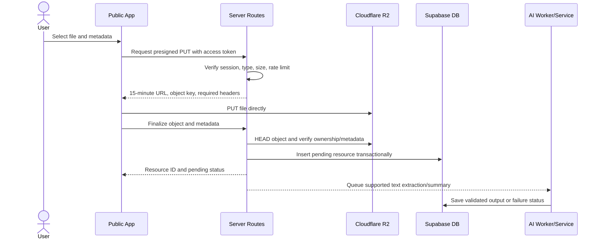
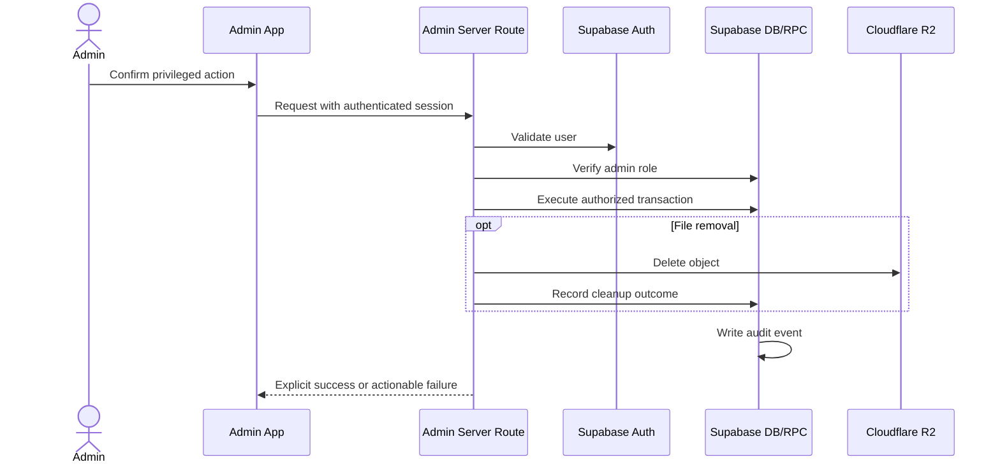

# STUDYDOCK Platform Implementation Plan

| Field | Value |
| --- | --- |
| Plan version | 3.2 |
| Last updated | August 3, 2026 |
| Applies to | `STUDYDOCK/`, `STUDYDOCK-ADMIN/`, shared Supabase project |
| Source of requirements | `srs_document.md` version 3.2 |
| Delivery approach | Security-first, incremental, migration-driven |

## 1. Objective

Deliver a production-ready public study-material application and a separately deployed admin application on top of a secure shared backend. The work will preserve the existing UI where practical, replace fixture or simulated behavior with live services, and close authorization and data-integrity gaps before enabling privileged workflows.

This plan does not treat the existing walkthrough as proof of completion. Each capability is complete only after its code, database policy, automated tests, and production-like verification satisfy the SRS acceptance criteria.

## 2. Repository baseline

### 2.1 Public App - `STUDYDOCK/`

Already present:

- Next.js 16.2.12 App Router, React 19.2, TypeScript 5.9, Tailwind, Radix UI, and Framer Motion. The security upgrade includes async request APIs, the `proxy.ts` convention, ESLint 9 flat configuration, and audited PostCSS/Sharp overrides.
- Supabase sign-up/sign-in and browser client.
- Pages for home, explore, resource details, upload, dashboard, universities, leaderboard, and study notes.
- Initial database schema and migrations for profiles, reference data, resources, notes, courses, RLS, counters, merge RPCs, and fuzzy search.
- R2 client and routes for presigned upload/download URLs.
- Gemini adapter and summarization route.

Implemented in the current working tree:

- Live, bounded home/explore/detail/university/leaderboard/dashboard APIs and pages using `search_resources_v2` and visibility-aware RLS.
- Registration, sign-in, verification resend, OAuth initiation, recovery/reset, password change, SSR cookie refresh, protected navigation, and sign-out.
- Server-validated 15-minute R2 presign, object `HEAD`, transactional/idempotent finalization, MIME-extension binding, checksum support, and orphan cleanup tracking.
- Authenticated download and AI endpoints with database-backed per-account rate limits and stable no-store error contracts.
- Same-origin mutation checks, verified-email upload enforcement, and combined account plus HMAC-IP rate limits.
- Asynchronous PDF worker with bounded source size/page count, service-role-only claim/complete/fail RPCs, stale-lock recovery, retries, and validated Gemini output.
- Truthful private notes: owner CRUD, autosave states, temporary recording disclosure, browser speech-to-text capability handling, and authenticated note summaries.
- True server-side resource not-found responses and a policy-disabled, bounded delayed account-erasure worker.
- Node 20 CI plus full-history Gitleaks, dependency audit, Playwright accessibility checks, and desktop/mobile visual baselines for auth, home, explore, universities, and leaderboard.

Remaining release evidence/gaps:

- The new migrations have not been applied because this workstation has no approved Supabase migration/service-role credential.
- Staging RLS, RPC, upgrade, R2 partial-failure, credential-backed upload/dashboard/notes E2E, manual accessibility, and representative performance tests are still required. The local Public suite passes 17 unit/contract tests and 15 browser checks.
- Persistent note audio/OCR remain outside release-one scope pending policy decisions.

### 2.2 Admin App - `STUDYDOCK-ADMIN/`

Already present:

- Next.js 16.2.12 App Router/React 19 application on port 3001 with the `proxy.ts` network boundary and ESLint 9 flat configuration.
- Dashboard counts and pages for universities, courses, and resource records.
- UI calls to edit university/course rows and execute merge RPCs.

Implemented in the current working tree:

- Email/password login, PKCE callback, SSR session refresh, protected server layout, active-admin checks, forbidden page, safe return path, identity display, and sign-out.
- Live dashboard with moderation/AI/cleanup metrics and recent audit activity.
- Audited university/course edit, approval, dependency-safe rejection, collision-aware merge preflight/execute, search, and bounded lists.
- Resource moderation with status/type/uploader/university/course filters, forced-download review, feature/removal actions, permanent R2-plus-database deletion, and retryable cleanup operations.
- Privacy-safe paginated user search, role/status changes, confirmation, audit references, and last-active-admin protection.
- Typed-confirmation logical account deletion with a 30-day recovery hold, reactivation, and erasure-job visibility.
- Server-side search/filter/pagination for universities, courses, resources, and users, with bounded server-side merge-target lookup.
- Operations page for retrying cleanup and AI jobs and inspecting erasure jobs; lint/typecheck/test/build and login browser/accessibility/visual checks pass locally.
- Repaired invalid Tailwind entry directives that caused the Admin App to render as largely unstyled HTML.

Remaining release evidence/gaps:

- The browser UI calls internally-authorized audited RPCs for several mutations; their defense-in-depth behavior must be proven with non-admin identities after migration deployment.
- A formal recent-authentication step for the highest-impact production actions is recommended before launch.
- Credential-backed admin/non-admin and destructive-operation browser tests remain pending staging identities and deployed migrations.

### 2.3 Database

Three additive corrective migrations are now authored:

- `20260803120000_secure_rbac_and_rpc.sql` establishes corrected RBAC/RPC foundations.
- `20260803130000_resource_lifecycle_and_search_v2.sql` adds normalized catalog ownership, moderation/account/AI state, audit/cleanup/delayed-erasure jobs, privacy-safe grants, combined account/IP rate limits, transactional finalization, ranked search, merge preflight/execute, admin/user functions, permanent deletion, and service-role workers.
- `20260803140000_private_data_account_state.sql` preserves the prior migration checksum while tightening private owner reads and resource mutations for active, suspended, and deleted accounts.

They remain **authored, not deployed**. Completion requires a fresh-database test and an upgrade test against a staging copy. The migration deliberately aborts on legacy normalized duplicates rather than guessing which records to merge; operators must resolve reported duplicates and rerun.

### 2.4 Verified access baseline

The following access was verified without exposing credential values or mutating live data:

| Service/capability | Current availability | Consequence |
| --- | --- | --- |
| Supabase project URL and anonymous key | Configured in `STUDYDOCK/.env`; read access to live universities, categories, courses table, and resources was confirmed | Public reads can work subject to RLS; this does not permit migrations or unrestricted writes |
| Supabase migration access | Not configured; Supabase CLI is not installed/linked and no database password, access token, service-role key, or database URL was found | This environment cannot currently apply DDL migrations or perform unrestricted database administration |
| Authenticated test user/admin session | Not configured for diagnostics | Owner/admin insert, update, delete, and RPC behavior cannot yet be certified against the live project |
| Admin App Supabase configuration | `STUDYDOCK-ADMIN/.env.local` contains the shared public Supabase configuration; the login/gate code and production build pass | A designated active admin and regular-user session are still needed for end-to-end authorization evidence |
| Cloudflare API token | The replacement token is active and can read the stated account, but the R2 bucket-list request returns HTTP 403 | It is not required by the application and is not stored; review its scope only if Cloudflare management automation is needed |
| Cloudflare R2 S3 credentials | A complete credential pair and endpoint are now stored in the ignored Public App `.env.local`; the application typecheck/build passes | Credential evaluation and object operations remain unverified because TLS negotiation with the R2 endpoint fails from the current Windows environment before S3 authentication |
| Gemini | The screenshot-derived credential returns HTTP 401 from the Gemini models API and is not stored | AI remains disabled/deferred until a valid server-side key is provided and verified |

Do not test unrestricted insert/delete access against live data. First create a staging project or designated test records, obtain explicit migration credentials, and run the RLS matrix under controlled identities.

### 2.5 Admin App failure assessment

The original Admin App failure modes have been repaired in code. The table below distinguishes completed recovery from deployment evidence that is still missing:

| Failure | Current cause | Recovery phase |
| --- | --- | --- |
| Local pages previously could not load live data | Admin `.env.local` was missing; the verified Supabase public configuration has now been added and read-tested | Configuration fixed locally; remove placeholder code fallback in Phase 0 |
| Admin pages rendered as mostly unstyled HTML | `app/globals.css` used invalid `@tailwindcss` directives, leaving Tailwind utilities uncompiled | Corrected to Tailwind 3 directives and protected by Playwright desktop/mobile snapshots |
| Administrator sign-in | Implemented email/password sign-in with an SSR cookie session and profile-role check; provider/identity setup is not yet verified end to end | Phase 1 verification |
| Protected content | Implemented middleware plus a protected server layout that checks `profiles.role` before rendering the Admin shell | Phase 1 verification |
| University/course/resource writes | Corrective admin RLS policies are authored but not applied to the Supabase project | Apply and verify Phase 1 migration |
| Merge RPC authorization | Internal admin checks, fixed `search_path`, validation, collision preflight/handling, audit, and constrained grants are authored | Apply/verify Phase 1 and 2 migrations |
| Resource permanent deletion | Server route revokes visibility, deletes R2, records partial failure, retries from Operations, and deletes the DB row only after object success | Configure rotated Admin R2 secrets and run failure-injection tests |
| Dashboard query failures | Live overview and audit feed render explicit errors | Verify against deployed functions and injected query failure |
| Moderation and operations | Lifecycle actions, proposal review, forced review download, cleanup/AI operations, and user administration are implemented | Run the non-admin/admin E2E and audit matrix |

The Admin App is now a deployable implementation candidate, not a certified production control plane. Keep destructive production actions disabled until the database and external-service tests pass.

## 3. Delivery principles

1. **Secure the backend before exposing admin workflows.** UI guards and database authorization are both required.
2. **Migrations are forward-only.** Add corrective timestamped files after `20260803071000`; never modify an applied migration.
3. **Server boundaries own privileged behavior.** R2, AI, moderation, role changes, counters, and finalization run through validated server routes or secured RPCs.
4. **The database is the source of truth.** Production pages do not mix fixture and live records.
5. **Long-running/enrichment work is non-blocking.** Upload success does not depend on AI success.
6. **Every phase has a release gate.** A phase may merge without deployment only when its feature flag/default state is safe.
7. **Failures are recoverable.** R2 cleanup, AI retry, merge rollback, and deployment rollback are designed before launch.
8. **Preserve the Public App design.** Retain its approved layout, design tokens, components, motion language, and navigation while replacing data and backend behavior. Make visual changes only for documented accessibility, security, error-state, or approved product needs.

### 3.1 Public design-preservation method

Before modifying each Public App page:

1. capture desktop and mobile screenshots as the visual baseline;
2. identify the existing components and states that must be retained;
3. separate data fetching/state logic from presentation instead of rewriting the presentation wholesale;
4. add loading, empty, and failure states using the current design system;
5. run screenshot comparison after live integration; and
6. record any intentional difference with its requirement and approval.

The reusable components in `STUDYDOCK/components/`, global tokens in `app/globals.css`, and Tailwind configuration remain the default presentation source. Fixture data may be removed from production paths without removing its associated UI behavior.

## 4. Target request flows

### 4.1 Upload flow

### 4.2 Admin mutation flow

## 5. Work breakdown and phases

Status values in this plan are **Existing**, **Partial**, and **Not started**. They describe the reviewed code, not deployment state.

### Phase 0 - Baseline, environments, and decision log

**Goal:** Create a safe development baseline and resolve decisions that affect schema or architecture.

| Task | Status | Deliverable |
| --- | --- | --- |
| Confirm local, staging, and production Supabase projects | Not started | Environment matrix with project identifiers stored outside source |
| Confirm hosting provider and runtime for both apps | Partial | Vercel/Node 20 deployment setup is documented for both apps; projects, domains, and background-job approach remain to be configured |
| Define content/moderation policy and uploader attestation | Not started | Approved policy linked from upload and admin UI |
| Decide supported extraction formats and audio retention | Not started | Architecture decision records (ADRs) |
| Capture clean baseline builds and current test failures | Partial | Both production builds/typechecks pass; the Public App has auth plus four public-page accessibility and desktop/mobile visual baselines, while credential-backed/RLS/load/manual-accessibility evidence remains |
| Add `.env.example` files without secrets | Existing | Public and Admin templates exist; local files are ignored |
| Provision and verify migration access for a staging Supabase project | Not started | Installed/authenticated CLI or approved CI migration identity plus linked project |
| Provision R2 staging credentials, private bucket, and CORS policy | Partial | Local S3 credentials configured and app build passes; endpoint TLS, bucket existence/access, CORS, and object smoke test remain |
| Add Public Supabase variables to the Admin deployment | Partial | Local Admin environment and live read verified; deployment environment remains |
| Decide whether to provision Gemini now or defer behind a disabled flag | Not started | Server-side key and budget/policy, or explicit deferred configuration |
| Document Vercel setup for both repositories | Existing | Root `setup.md` in each project covers build settings, environment scopes, callbacks, migration order, verification, and rollback |

Implementation notes:

- Remove hard-coded Cloudflare account/access-key fallbacks from `STUDYDOCK/lib/cloudflare-r2.ts`.
- Make startup fail clearly on the server when required production variables are absent.
- Keep placeholder Supabase values only in test-specific configuration, not runtime application code.
- Add these scripts to both packages: `lint`, `typecheck`, `test`, and `build`.
- Create a designated staging admin user through an audited operator procedure; never promote an arbitrary production account for testing.
- Apply migrations first to local/staging, then verify their recorded checksums before production.
- Revoke and recreate credentials that have been pasted into chat, screenshots, tickets, logs, or other non-secret systems before production use.
- Do not put the Cloudflare management API token into `CLOUDFLARE_R2_SECRET_ACCESS_KEY`; it is a different credential type and cannot sign S3 requests.

#### 0.1 R2 verification blocker and next check

The configured account endpoint currently fails TLS negotiation from the development machine in both the AWS SDK and Windows HTTP client before an S3 response is received. This does not prove that the S3 credentials are valid or invalid. Resolve and verify in this order:

1. confirm the exact S3 endpoint and `studydock-resources` bucket in the Cloudflare dashboard;
2. test the endpoint from the intended deployment runtime or another current TLS client/network;
3. confirm the S3 token has Object Read & Write permission for the target bucket;
4. configure bucket CORS for the exact Public App staging origin and required `PUT`, `GET`, and headers;
5. upload a uniquely named diagnostic object, then `HEAD`, download, and delete that exact object;
6. verify presigned PUT and GET through the application's route helpers; and
7. rotate the exposed credential pair, update the secret store, and repeat the smoke test before production.

Do not mark R2 complete based only on a successful Next.js build; build-time validation does not contact the bucket.

**Gate P0:** Both apps install and build from a clean checkout; no committed secret is detected; unresolved product decisions have owners.

### Phase 1 - Authorization and security foundation

**Goal:** Close privilege-escalation paths before expanding functionality.

#### 1.1 Corrective security migration

**Implementation status:** Authored in
`supabase/migrations/20260803120000_secure_rbac_and_rpc.sql`; application to
staging/production and RLS/RPC identity-matrix tests remain required.

Create a new migration such as:

`STUDYDOCK/supabase/migrations/20260803xxxxxx_secure_rbac_and_rpc.sql`

It must:

1. add a reusable `public.is_admin()` function that checks `auth.uid()` safely;
2. set a fixed `search_path` and schema-qualify every `SECURITY DEFINER` function;
3. revoke default/public execution from privileged functions;
4. grant only the minimum required calls to `authenticated` after internal admin validation;
5. add admin policies for universities, departments, subjects, categories, courses, resources, and safe profile administration;
6. add authenticated proposal policies for universities/courses with `custom_pending` forced by policy or server code;
7. prevent users from updating protected profile fields such as `role`, points, and counters through a general self-update policy; and
8. replace client-controlled counter RPC parameters with caller-derived identity where appropriate.

Do not expose service-role credentials in either application.

#### 1.2 Admin application authentication

**Implementation status:** Admin login, PKCE callback, cookie-refresh
middleware, non-admin forbidden route, protected server layout, verified admin
identity display, and sign-out are implemented. Live tests with designated user
and admin identities remain required.

Add:

- an admin sign-in/session-expired page;
- server-compatible Supabase clients for browser and server contexts;
- middleware or protected server layouts that verify a session;
- a server-side role check before protected content is rendered; and
- a 403/not-authorized experience for authenticated non-admins.

All admin mutations should move behind route handlers or server actions that repeat the role check. The RPC remains responsible for its own authorization as defense in depth.

#### 1.3 Public registration and login completion

**Implementation status:** Existing visual design is retained. Email/password
registration and login, email verification handling, OAuth initiation, safe
return paths, password recovery/reset, cookie-backed SSR sessions,
protected-route middleware, and sign-out are implemented. Provider configuration,
email delivery, abuse limits, and browser E2E tests remain.

Preserve the existing `/auth` page design while separating and completing these states:

1. **Register:** full name, email, password, confirmation/terms as approved; validate duplicates, weak passwords, provider errors, and pending submission.
2. **Verify email:** confirmation screen, resend with cooldown, allowlisted callback, expired-link recovery, and post-verification redirect.
3. **Sign in:** generic invalid-credential errors, validated same-origin return path, and session-aware redirect if already signed in.
4. **Forgot password:** neutral response regardless of account existence and rate-limited provider call.
5. **Reset password:** callback/session validation, new-password confirmation, expired-link recovery, and success redirect.
6. **Session handling:** one shared auth provider/helper for restoration, refresh, `onAuthStateChange`, sign-out, and removal of private client state.
7. **Protected navigation:** upload, dashboard, study notes, and settings preserve their requested return URL and never flash private content.
8. **Profile safety:** update RLS or provide narrow RPCs so self-service editing cannot alter role, points, counters, badges, or verification flags.

Recommended file-level work:

- refactor `STUDYDOCK/app/auth/page.tsx` without replacing its visual composition;
- add recovery/reset/callback routes or pages using the chosen Supabase SSR pattern;
- add shared browser/server Supabase helpers and an auth context only where client reactivity is needed;
- add protected-layout or proxy behavior compatible with the current supported Next.js release; and
- add account/session error components styled with the existing UI primitives.

#### 1.4 Admin recovery sequence

Recover the Admin App in this order:

1. remove placeholder Supabase fallbacks and add validated configuration;
2. add sign-in and server session support;
3. protect the entire admin route tree and render a 403 state for non-admin users;
4. secure RLS/RPC before enabling any edit or merge button;
5. move privileged mutations to server boundaries;
6. add explicit loading/error states to every query; and
7. enable one read-only dashboard page first, followed by university, course, and resource workflows after their tests pass.

#### 1.5 Route hardening

**Implementation status:** Upload, download, and AI routes now use strict Bearer
parsing, per-request JWT-bound Supabase clients, Zod validation, stable error
contracts, request IDs, redacted user-facing failures, and `no-store` responses.
The upload presign lifetime is 15 minutes. Database-backed per-account rate
limiting, R2 `HEAD` finalization, idempotency, and cleanup tracking are now
implemented; IP/provider abuse limits and production verification remain.

Update public upload, download, and AI routes to:

- parse `Bearer` headers strictly;
- validate bodies with Zod and return stable error structures;
- apply request and user rate limits;
- use `Cache-Control: no-store` for signed URL responses;
- reject unsupported `storage_provider` values;
- avoid returning internal exception strings in production; and
- emit structured, redacted logs with request IDs.

**Tests:** registration, duplicate registration, sign-in, sign-out, verification, recovery, reset, session expiry/refresh, safe return path, RLS matrix, anonymous/user/admin RPC calls, non-admin Admin App access, protected-field update, malformed tokens, redirect-loop prevention, and secret scan.

**Gate P1:** Public registration/login/recovery/session flows work end to end; no visitor or regular user can execute an admin mutation, change protected profile fields, or access an Admin App page/API.

#### 1.6 Remaining evidence before Gate P1 can pass

1. Apply the corrective migration to an isolated staging Supabase project.
2. Test anonymous, User A, User B, and admin table/RPC permissions.
3. Configure production/preview callback allowlists and validate email delivery.
4. Verify registration, verification, login, logout, recovery, reset, expiry,
   refresh, safe return paths, and OAuth-provider failure states in a browser.
5. Add a Vercel-compatible distributed rate limiter for auth-adjacent API routes.
6. Move remaining privileged Admin mutations behind server route/action boundaries.
7. Confirm logs and built client assets contain no tokens or server secrets.

### Phase 2 - Data model, lifecycle, and merge integrity

**Goal:** Establish the state machines and auditability required by both applications.

**Current status:** Code complete/pending deployment verification. The lifecycle/search migration contains the schema, normalization, visibility, audit, proposal, merge, user-state, cleanup, and worker contracts described below. Gate P2 remains blocked on database operator access and staging identity/rollback tests.

#### 2.1 Lifecycle schema migration

Create a migration such as:

`STUDYDOCK/supabase/migrations/20260803xxxxxx_add_resource_lifecycle_and_audit.sql`

Add:

- `resource_status` enum: `pending`, `approved`, `rejected`, `removed`;
- `ai_processing_status` enum: `not_requested`, `queued`, `processing`, `completed`, `failed`;
- numeric `size_bytes`, `mime_type`, `original_file_name`, optional checksum, moderation timestamps/reasons, and AI error/attempt metadata;
- `admin_audit_log` with actor, action, target type/ID, request ID, and `jsonb` before/after or details;
- optional `storage_cleanup_jobs` or an equivalent retry table;
- indexes for moderation queues, approved discovery, uploader history, and AI/cleanup jobs; and
- `updated_at` maintenance on mutable entities.

Backfill existing resource records deliberately. If their moderation state is unknown, choose and document whether they become `pending` or are reviewed before `approved`.

#### 2.2 Canonical normalization

- Normalize course codes (trim, uppercase, canonical separator policy).
- Add case-insensitive or normalized uniqueness for university names and course codes per university.
- Add database constraints for allowed MIME/storage providers and non-negative counters.
- Decide how legacy `file_path`/`file_url` fields coexist with `storage_key`; document and implement the migration window.

#### 2.3 Merge v2 functions

Replace or version `merge_universities` and `merge_courses` with functions that:

- verify admin authorization internally;
- validate/lock source and target;
- calculate affected rows for a preflight function;
- detect collisions before updates;
- merge or report duplicate departments/subjects/courses deterministically;
- keep resource university/course relationships consistent;
- update derived counts;
- write one audit record in the same transaction; and
- roll back completely on any failure.

Add a dry-run/preflight RPC returning affected counts and conflicts. The UI must display this before destructive confirmation.

**Tests:** fresh migration test, upgrade-from-current-schema test, constraints, backfill assertions, same-ID merge, missing records, non-admin caller, cross-university course merge, uniqueness collision, dependent-row reassignment, audit record, and transaction rollback.

**Gate P2:** A database test suite proves authorization, lifecycle visibility, merge integrity, and rollback behavior.

### Phase 3 - Public discovery and live data

**Goal:** Remove production dependence on `lib/data.ts` for resource and community content.

**Current status:** Application integration complete/pending staging verification. Production pages no longer import fixture catalog data, and all list/search calls are bounded. Auth, home, explore, universities, and leaderboard now have desktop/mobile visual baselines and automated serious/critical accessibility checks. Gate P3 still requires deployed RLS/search functions, credential-backed not-found checks, representative query plans, and manual accessibility evidence.

#### 3.1 Search API/RPC v2

Implement a paginated database query that:

- searches title, description, tags, AI topics, university name, course code, and course title;
- combines normalized exact matches, PostgreSQL full-text rank, and trigram similarity;
- filters to `approved` for public callers while allowing owners/admins their appropriate view;
- accepts validated university/course/category/file-type filters;
- accepts a bounded page size and stable cursor or offset;
- returns a total or `hasMore` without expensive unbounded scans; and
- uses indexes verified with `EXPLAIN (ANALYZE, BUFFERS)` against representative data.

Do not interpolate user text into SQL. Keep the search RPC `STABLE` only if its behavior permits it and explicitly set grants.

#### 3.2 Connect public pages

Update:

- `app/explore/page.tsx` to fetch live, paginated results with URL-backed filters;
- `app/resource/[id]/page.tsx` to fetch joined live details and proper not-found states;
- homepage featured/trending sections;
- university list/detail pages;
- dashboard uploads/bookmarks when those tables/features exist; and
- leaderboard with privacy-safe fields and real pagination.

Keep fixture data available only for Storybook/tests or an explicit demo flag.

For every page conversion, retain the current page structure and styling by replacing only the data adapter and state handling unless a separately documented change is required. Visual-regression baselines are part of the pull request evidence.

#### 3.3 UX requirements

- Debounce search input and cancel stale requests.
- Preserve filters in the URL.
- Provide skeleton, empty, retryable error, and pagination states.
- Use accessible labels and keyboard-operable filters.

**Tests:** exact/fuzzy code search, combined filters, moderation visibility, pagination stability, empty query, special characters, slow/failing backend, keyboard navigation, and public page smoke tests.

**Gate P3:** Production public browsing uses only live, correctly authorized data and meets the agreed p95 search target on representative staging data.

### Phase 4 - Reliable upload, R2, and AI pipeline

**Goal:** Make uploads verifiable, recoverable, and safe while separating AI enrichment from upload success.

**Current status:** Application and migration code complete/pending external-service verification. Presign/finalize/cleanup and the PDF worker are implemented. The local R2 diagnostic currently fails during TLS negotiation, and no rotated Gemini/service-role secrets are installed; Gate P4 cannot pass until Vercel/Node 20 staging smoke and failure-injection tests succeed.

#### 4.1 Presigned upload improvements

Update `app/api/upload/presigned-url/route.ts` and `lib/cloudflare-r2.ts`:

- validate name, MIME, extension, numeric size, and optional checksum server-side;
- use UUID-based keys under `resources/{userId}/`;
- reduce expiry to 15 minutes or less;
- return required headers and an absolute expiration timestamp;
- configure bucket CORS for only approved public-app origins and methods;
- add per-user rate and storage quotas; and
- add R2 `HEAD` and `DELETE` helpers.

#### 4.2 Finalization route

Create `app/api/upload/finalize/route.ts`:

1. validate the session and metadata;
2. confirm the object key belongs to the caller;
3. `HEAD` the object and compare type/size/checksum;
4. validate university/course/category relationships;
5. insert the `pending` resource and update counters through a transaction/RPC;
6. enqueue AI work only for supported formats; and
7. delete or schedule cleanup for invalid/orphaned objects.

The browser must no longer insert the final resource row or award points directly.

#### 4.3 Document extraction and AI

- Select and document the PDF extraction boundary: isolated server worker is preferred for untrusted files; client extraction is acceptable only with explicit limits and no integrity assumptions.
- Treat extracted content as untrusted prompt data.
- Move model selection to configuration and use a currently supported model approved during Phase 0.
- Require authentication and rate limiting.
- Validate model output with Zod rather than `JSON.parse` plus fallback assumptions.
- Store statuses, attempts, timestamps, and a sanitized failure code.
- Provide retry with a maximum attempt count and cost guard.
- Label output as AI-generated in the UI.

#### 4.4 Upload UI

Update `app/upload/page.tsx` to:

- use returned required headers;
- show separate upload/finalization/processing states;
- preserve form metadata after retryable failures;
- display moderation status accurately;
- prevent duplicate submission; and
- handle custom university/course duplicates and validation errors.

**Tests:** unsupported type, spoofed MIME, oversized file, expired URL, key ownership attack, missing R2 object, metadata mismatch, duplicate finalize, DB failure after PUT, cleanup retry, AI timeout/malformed output, and successful end-to-end upload/download.

**Gate P4:** An authorized upload produces one verified database record and one R2 object; every simulated partial failure has a cleanup or retry outcome.

### Phase 5 - Study notes and user features

**Goal:** Make the existing notes experience truthful, private, and persistent.

**Current status:** Release-one behavior implemented/pending RLS/browser E2E. Owner CRUD/autosave, visible failures, suspended-account read-only behavior, and active/suspended/deleted private-read migration policy are present. Recordings are intentionally session-only, live transcription is capability-detected, and note summaries use the authenticated Gemini adapter. Persistent audio is not promised and remains deferred until retention policy approval.

#### 5.1 Notes correctness

- Keep all CRUD under owner-only RLS.
- Implement debounced autosave with conflict/error feedback.
- Add confirmation and accessible feedback for deletion.
- Ensure a session change clears private cached state.

#### 5.2 Audio and transcription

Based on the Phase 0 decision:

- If audio persistence is in scope, upload recordings to a private, user-scoped object path and issue short-lived playback URLs.
- Enforce maximum duration and byte size.
- If audio persistence is out of scope, label recording as session-only and do not store misleading persistent metadata.
- Implement speech-to-text with capability detection (`SpeechRecognition`/`webkitSpeechRecognition`) or the selected server transcription provider.
- Allow transcript review/editing before save and display unsupported-browser/permission states.

#### 5.3 Note summaries

Replace the timer-based simulated summary with the authenticated AI adapter, or explicitly retain a labeled local heuristic. Summary failure must never overwrite note content.

**Tests:** cross-user isolation, autosave failure/retry, microphone denial, unsupported browser, recording size limit, session reload persistence, transcription editing, and AI failure.

**Gate P5:** Notes are private, saved state is accurate, and every recording/transcription claim matches actual persistence and browser capability.

### Phase 6 - Complete Admin App workflows

**Goal:** Deliver usable, audited curation and moderation after backend security is proven.

**Current status:** Workflow code complete/pending deployed authorization verification. Dashboard, proposals, server-paginated lists, bounded university/course lookups, resource filters for status/type/uploader/university/course, merge, moderation, review download, permanent deletion, cleanup/AI/erasure operations, users, roles, account states, and logical deletion/recovery are present. Gate P6 still requires non-admin negative tests, R2/erasure failure injection, audit inspection, and confirmation that all migrations are active.

#### 6.1 Dashboard and navigation

- Display counts by moderation/AI/cleanup state and recent audited actions.
- Preserve explicit loading and query-error states; never translate a failed count to zero.
- Add responsive navigation and a signed-in admin identity/sign-out control.

#### 6.2 University and course management

- Add server-side search, filters, and pagination.
- Validate edits with shared schemas.
- Add approve/reject workflows.
- Call merge preflight, display affected counts/conflicts, require typed or explicit confirmation, then execute merge v2.
- Refresh data from the server after mutation and display the audit reference.

#### 6.3 Resource moderation and R2 cleanup

- Add moderation queue filters and a safe metadata/preview panel.
- Add approve, reject with reason, feature/unfeature, remove, and retry-cleanup actions.
- Route removal through a server operation that updates visibility, deletes R2 state, and records partial failure.
- Never render active content from untrusted HTML; use safe file previews or forced download/sandboxing.

#### 6.4 User and role management

- Add a privacy-safe user list and activity summary only if approved for this release.
- Implement role changes server-side with confirmation, audit, and last-admin protection.

**Tests:** non-admin access, list pagination, query failure, validation, approve/reject visibility, feature changes, merge preview/execute, R2 deletion success/failure/retry, audit fields, role changes, and last-admin protection.

**Gate P6:** Every admin action is authorized twice (server boundary and database), audited, recoverable, and verified end to end.

### Phase 7 - Quality, operations, and launch

**Goal:** Verify the platform as one ecosystem and establish safe deployment operations.

**Current status:** Both repositories now contain Node 20 GitHub CI for lockfile installation, full-history Gitleaks scanning, lint, typecheck, unit/static-contract tests, production build, dependency audit, and Playwright. The Public App locally passes 17 unit/contract tests and 15 browser checks across auth and the four main public catalog pages; Admin login accessibility and desktop/mobile visual checks pass, and the Admin CSS failure is regression-covered. Real database/RLS tests, credential-backed staging journeys, manual accessibility/performance/restore tests, production observability, rotated secrets, and launch approval remain open.

#### 7.1 Automated quality gates

For both applications, CI must run:

1. dependency installation with lockfile enforcement;
2. secret and dependency vulnerability scans;
3. lint;
4. TypeScript type checking;
5. unit/component tests;
6. database migration and policy tests;
7. production build; and
8. critical Playwright end-to-end journeys against staging.

#### 7.2 Observability

Add structured, redacted logging and dashboards/alerts for:

- route error rate and latency;
- R2 presign, upload finalization, and deletion failures;
- AI queue age/failure/cost;
- moderation backlog;
- merge failures;
- cleanup backlog; and
- authentication/authorization rejection spikes.

#### 7.3 Accessibility and compatibility

- Run automated accessibility checks and manual keyboard/screen-reader checks for auth, search, upload, notes, moderation, and merge dialogs.
- Test current/previous Chrome, Edge, Firefox, and Safari.
- Test mobile layouts down to 320 px.

#### 7.4 Production readiness

- Apply migrations to staging and execute the full regression suite.
- Take and verify a database backup before production migration.
- Configure R2 CORS/lifecycle rules, Supabase redirect URLs, rate limits, and provider budgets.
- Document support ownership, incident response, backup restoration, content takedown, and key rotation.
- Perform a limited rollout with feature flags for uploads, AI, and destructive admin operations.

**Gate P7:** All SRS release acceptance criteria pass, rollback has been rehearsed, and designated product/engineering owners approve launch.

## 6. Requirement traceability

| SRS area | Primary delivery phase | Verification |
| --- | --- | --- |
| PUB-AUTH | Phase 1 and 3 | Auth integration and protected-route tests |
| PUB-SRCH / PUB-RES | Phase 3 | Database/search tests and public E2E |
| PUB-UPL | Phase 4 | Route/R2 integration and failure-injection tests |
| PUB-AI | Phase 4 | Extraction, schema-validation, retry, and UI tests |
| PUB-NOTE | Phase 5 | RLS, persistence, browser-capability, and E2E tests |
| PUB-COM | Phase 3 and 5 | Live-data and counter-integrity tests |
| ADM-AUTH | Phase 1 | Non-admin negative tests at page, API, and RPC layers |
| ADM-DASH / ADM-UNI / ADM-CRS / ADM-RES / ADM-USR | Phase 6 | Admin E2E plus database transaction tests |
| SEC | Phase 1, 2, and 7 | RLS matrix, scans, configuration review, penetration checks |
| Non-functional requirements | Phase 7, with earlier phase gates | Load, accessibility, compatibility, recovery, and operations tests |

## 7. Test strategy

### 7.1 Unit and component tests

- Zod request/response schemas and normalization utilities.
- File-name/key generation and MIME/extension policy.
- Search filter serialization and result states.
- AI output parsing and prompt-size limits.
- Admin confirmation and error-state components.

### 7.2 Database tests

Use a local or isolated Supabase environment. Test each table/action under four identities: anonymous, User A, User B, and admin.

Required suites:

- RLS select/insert/update/delete matrix;
- protected profile-field mutation;
- resource visibility by moderation state;
- counter authorization and atomicity;
- university/course normalization and uniqueness;
- merge preflight and transaction behavior;
- audit-log immutability; and
- migration from the current schema plus fresh reset.

### 7.3 Integration tests

- Authenticated presign -> R2 PUT -> finalize -> DB record.
- Approved resource -> authenticated download -> atomic counter.
- Resource removal -> visibility change -> R2 deletion -> audit.
- Extracted text -> AI response validation -> stored status/output.
- Cleanup/AI transient failure -> retry -> terminal status.

Use provider test accounts/buckets and never production objects.

### 7.4 End-to-end tests

Critical journeys:

1. Visitor searches approved resources and is prompted to sign in for download.
2. User registers, proposes missing metadata, uploads a PDF, and sees pending/AI states.
3. Admin approves or merges proposed metadata and approves the resource.
4. A second user discovers and downloads the approved resource.
5. User creates, saves, reloads, and deletes a private note.
6. Non-admin attempts every Admin App URL and privileged API/RPC and is rejected.
7. Admin removes a resource and verifies it is no longer discoverable and its object is cleaned up.

### 7.5 Performance tests

Seed representative universities, courses, users, and at least the agreed target resource volume. Measure p50/p95/p99 for search, list, presign, finalization, and admin queues. Index/query work is complete only when plans and measurements are stored with the test report.

## 8. Environment configuration

### Public App server environment

- `NEXT_PUBLIC_SUPABASE_URL`
- `NEXT_PUBLIC_SUPABASE_ANON_KEY`
- `NEXT_PUBLIC_SITE_URL`
- `SUPABASE_SERVICE_ROLE_KEY` (server-only; used only by the internal AI worker)
- `CLOUDFLARE_R2_ACCOUNT_ID`
- `CLOUDFLARE_R2_ACCESS_KEY_ID`
- `CLOUDFLARE_R2_SECRET_ACCESS_KEY`
- `CLOUDFLARE_R2_ENDPOINT` (optional when derived safely)
- `CLOUDFLARE_R2_BUCKET_NAME`
- `UPLOAD_MAX_BYTES`
- `GEMINI_API_KEY`
- `GEMINI_MODEL`
- `CRON_SECRET`
- `AI_MAX_SOURCE_BYTES`
- rate-limit/observability variables selected for deployment

Database migration variables or tokens MUST NOT be placed in the Public App runtime environment. They belong in the operator workstation/CI secret scope used for reviewed migration execution. The service-role key is a separate runtime secret used exclusively by the cron worker; it MUST never be imported by a client component, logged, or reused as a general application database client.

### Admin App environment

- `NEXT_PUBLIC_SUPABASE_URL`
- `NEXT_PUBLIC_SUPABASE_ANON_KEY`
- `NEXT_PUBLIC_ADMIN_SITE_URL`
- `NEXT_PUBLIC_PORTAL_URL`
- the five server-only Cloudflare R2 account/access/secret/endpoint/bucket variables required by review download and cleanup routes
- observability variables

Environment templates MUST contain descriptions and safe examples, never real secrets. Production deployments MUST validate required configuration before serving traffic.

### Access verification checklist

Before any database or provider implementation phase begins:

- [ ] Supabase CLI or CI migration identity is installed, authenticated, and linked to the staging project.
- [ ] A database backup/branch exists before schema changes.
- [ ] A staging anonymous user, regular user, second user, and admin identity exist for RLS tests.
- [ ] R2 staging bucket is private and CORS allows only the approved Public App origin.
- [ ] R2 server credentials can perform presign, `HEAD`, and delete, but are unavailable to browser bundles.
- [ ] The Admin App has the same non-secret Supabase URL/anonymous key as the Public App and no placeholder fallback.
- [ ] Gemini is either configured server-side with limits or the AI feature flag is disabled with accurate UI copy.
- [ ] No command logs, CI output, or committed files reveal credentials.

## 9. Deployment and rollback

### 9.1 Deployment order

1. Back up the production database and capture current migration state.
2. Apply backward-compatible database migrations.
3. Run database smoke and RLS tests.
4. Deploy server routes/backend-compatible Public App changes with new features disabled.
5. Deploy the Admin App after its role gate and database controls pass.
6. Enable live search, then upload finalization, then AI processing, then destructive admin actions in that order.
7. Monitor errors, queues, and authorization failures after each enablement step.

### 9.2 Rollback strategy

- Prefer feature flags and backward-compatible columns so application rollback does not require immediate schema rollback.
- Do not destructively drop legacy columns in the same release that migrates their data.
- For a failed app deployment, restore the previous application artifact and disable affected flags.
- For a failed data migration, use the migration-specific compensating script validated in staging; never improvise destructive SQL in production.
- For R2/DB divergence, stop affected writes, run the reconciliation report, and use tracked cleanup/recovery jobs.
- Merge operations are transactionally rolled back during execution; post-commit reversal requires an audited backup/recovery procedure and is not assumed to be automatic.

## 10. Definition of done

A feature is done only when:

- its SRS requirement and acceptance criteria are satisfied;
- authorization is tested for anonymous, owner/user, other user, and admin where applicable;
- error, loading, empty, retry, and success states are implemented;
- database migrations work for both fresh install and upgrade;
- logs/metrics contain enough context to operate the feature without secrets;
- unit/integration/E2E tests appropriate to its risk pass in CI;
- accessibility and responsive behavior have been checked;
- Public App visual-regression evidence shows the approved design and existing feature surface were preserved;
- configuration and operational documentation are updated; and
- no known critical/high security issue remains open.

## 11. Suggested delivery milestones

These are dependency-based milestones rather than calendar promises. Estimate them after Phase 0 decisions and team capacity are known.

| Milestone | Included phases | Outcome |
| --- | --- | --- |
| M1: Secure foundation | 0-2 | Safe auth/RBAC, lifecycle schema, audit, and merge v2 |
| M2: Public discovery | 3 | Live database-backed public browsing and search |
| M3: Reliable contribution | 4-5 | Verified uploads, non-blocking AI, and truthful private notes |
| M4: Admin operations | 6 | Complete authorized and audited admin workflows |
| M5: Production launch | 7 | CI, observability, accessibility, recovery, and controlled rollout |

The critical path is **Phase 0 decisions -> Phase 1 authorization -> Phase 2 lifecycle/merge schema -> Phase 4 finalization and Phase 6 admin operations -> Phase 7 launch**. Public discovery work can begin after the moderation visibility rules from Phase 2 are stable.
