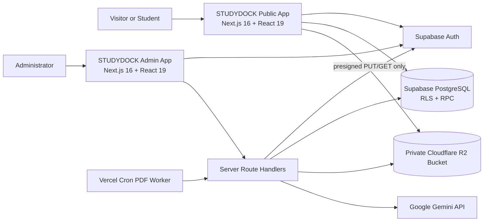

# Software Requirements Specification: STUDYDOCK Platform

| Field | Value |
| --- | --- |
| Document version | 3.2 |
| Product | STUDYDOCK Public App and STUDYDOCK Admin App |
| Status | Implementation baseline and target specification |
| Last updated | August 3, 2026 |
| Repositories | `STUDYDOCK/`, `STUDYDOCK-ADMIN/` |
| Shared services | Supabase Auth/PostgreSQL, Cloudflare R2, Google Gemini |

## 1. Purpose and document conventions

This document defines the required behavior, constraints, interfaces, and acceptance criteria for the STUDYDOCK platform. The platform consists of two separately deployed Next.js applications that share one backend:

1. **STUDYDOCK Public App** - discovery, upload, download, study notes, user dashboard, and community features.
2. **STUDYDOCK Admin App** - restricted curation, moderation, canonical-data management, and operational oversight.

The keywords **MUST**, **SHOULD**, and **MAY** describe mandatory, recommended, and optional behavior. A requirement is complete only when its acceptance criteria pass in a production-like environment.

This specification distinguishes the **target behavior** from the current codebase. Section 12 records known implementation gaps and prevents partially implemented features from being treated as complete.

## 2. Product vision, goals, and boundaries

### 2.1 Vision

STUDYDOCK gives university students a trustworthy place to discover and share course-specific study material while giving administrators the tools to maintain clean academic metadata and safe content.

### 2.2 Product goals

- Make resources discoverable by university, course, course code, category, file type, and keywords.
- Allow authenticated users to upload and retrieve files without routing large file bodies through the Next.js servers.
- Enrich supported documents with AI-generated summaries and topics without blocking the core upload flow.
- Let users create private study notes and optionally record lecture audio or create a live transcript.
- Keep user-created universities and courses separate from approved canonical records until reviewed.
- Give administrators auditable, least-privilege workflows for moderation and data merging.

### 2.3 Non-goals for the initial production release

- Selling copyrighted material or implementing a paid marketplace.
- Native iOS or Android applications.
- Live collaborative editing of notes.
- A general-purpose learning management system, grading system, or classroom roster.
- Guaranteed transcription on browsers that do not support the selected speech API.
- Training custom AI models on uploaded content.

### 2.4 Existing-design and feature-preservation constraint

The existing Public App visual identity, responsive layout, navigation model, typography, colors, cards, animation style, and principal page composition MUST remain intact unless a change is necessary for accessibility, security, correctness, or a newly approved product requirement. Backend integration work MUST not silently replace the current design with a generic interface.

The following existing Public App capabilities MUST remain available throughout implementation: home, explore/search, university browsing, resource detail, authentication, upload, dashboard, leaderboard, study notes, responsive navigation, and the existing reusable UI components. A capability may be placed behind a temporary feature flag only when its current behavior is unsafe or misleading. Any temporary disablement MUST be recorded, explained in the UI, and restored before the relevant release gate.

Before changing a public page, the team MUST capture a visual baseline at desktop and mobile widths. After integration, visual-regression checks MUST confirm that data-source changes did not unintentionally alter the approved presentation.

## 3. Stakeholders and user roles

| Role | Description | Primary capabilities |
| --- | --- | --- |
| Visitor | Unauthenticated user | Browse approved public metadata, search, view resource details, register or sign in |
| User | Authenticated student | Visitor capabilities plus upload, download, manage own resources, and manage private notes |
| Admin | Authenticated profile with `role = 'admin'` | Admin dashboard, reference-data curation, merge operations, moderation, and role-authorized maintenance |
| Operator | Deployment/database operator | Configure secrets, apply migrations, monitor services, restore data, and respond to incidents |

Admin status MUST be determined server-side from `profiles.role`. Hiding admin navigation in the browser is not an authorization control.

## 4. System context and architecture



### 4.1 Architectural rules

- Both applications MUST use the same Supabase project and canonical database schema.
- R2 and Gemini credentials MUST exist only in server-side runtime configuration.
- Privileged mutations MUST run through authenticated server routes or tightly controlled database functions.
- PostgreSQL Row Level Security (RLS) MUST remain enabled on every application table exposed through Supabase.
- New database changes MUST be additive migrations; previously deployed migrations MUST NOT be edited in place.
- Public and admin deployments MUST use separate origins. Their environment variables and redirect URLs MUST be explicitly configured.

### 4.2 Operational access and credential requirements

Having a Supabase anonymous key is not equivalent to having database administration access. Each credential MUST be limited to the task that requires it.

| Capability | Required access | Permitted use | Prohibited use |
| --- | --- | --- | --- |
| Public database reads and user-scoped writes | Supabase project URL plus anonymous key and, for protected actions, the user's JWT | Browser queries permitted by RLS | Schema changes, bypassing RLS, or admin operations |
| Database migrations | Supabase CLI/project access plus database password or an approved CI migration identity | Applying reviewed migration files in controlled environments | Embedding database passwords in either app or running ad-hoc production DDL from a browser |
| Administrative server operations | User JWT plus server/database role checks; service-role key only when an approved design requires it | Narrow server-side actions with validation and audit | Including the service-role key in `NEXT_PUBLIC_*` variables or client bundles |
| R2 object operations | R2 account ID, bucket, endpoint, access key ID, and secret access key | Server-side presign, `HEAD`, and delete operations | Exposing R2 secrets to the browser or storing signed URLs as permanent database links |
| Gemini analysis | Gemini API key stored server-side | Approved extraction/summarization jobs with limits | Client-side key exposure or sending unsupported/private content without policy approval |

Credentials MUST be stored in the deployment platform's secret manager or protected local environment files, rotated when exposed, and excluded from source control and logs. Migration and production credentials SHOULD be separate from application runtime credentials.

The database MUST store the durable R2 `storage_key` and provider, not an expiring presigned URL. Download URLs are generated on demand. Upload finalization MUST verify that the uploaded object exists before the row becomes a valid resource.

## 5. Shared domain model

### 5.1 Core entities

| Entity | Purpose | Required relationships and rules |
| --- | --- | --- |
| `profiles` | Application profile linked 1:1 to `auth.users` | Contains role, display details, university, and counters; users may update only safe self-service fields |
| `universities` | Canonical or user-proposed institution | Unique normalized name; status is `official` or `custom_pending` |
| `departments` | Department within a university | Belongs to one university; duplicate names within one university must be prevented or resolved during merge |
| `subjects` | Subject metadata | Belongs to one university |
| `courses` | University-specific course and code | Belongs to one university; normalized code must be unique within that university; status is `official` or `custom_pending` |
| `categories` | Resource classification | Publicly readable, admin-managed reference data |
| `resources` | Metadata and storage reference for an uploaded file | Belongs to an uploader; may link to university, course, and category; carries moderation and AI-processing states |
| `study_notes` | Private note owned by a user | Only the owner may read or mutate it |
| `admin_audit_log` | Immutable record of privileged operations | Records actor, action, target, timestamp, and structured before/after metadata |
| `storage_cleanup_jobs` | Retryable object-deletion work | Stores provider/key, attempt state, sanitized failure code, optional resource link, and whether DB deletion follows object deletion |
| `ai_processing_jobs` | Bounded asynchronous enrichment work | One job per resource, lock/attempt/retry state, maximum attempts, and sanitized failure code |
| `api_rate_limit_buckets` | Shared application rate-limit counters | Account/action/window key; callable only through the constrained rate-limit RPC |

### 5.2 Required status models

The platform MUST use these canonical values consistently:

- University/course status: `official`, `custom_pending`.
- Resource moderation status: `pending`, `approved`, `rejected`, `removed`.
- AI processing status: `not_requested`, `queued`, `processing`, `completed`, `failed`.

Only `approved` resources are visible to visitors. Uploaders MAY view their own pending or rejected resources. Admins MAY view all statuses.

Permitted state transitions are explicit:

| Entity | Transition | Authorized actor and effect |
| --- | --- | --- |
| Resource | new -> `pending` | Active uploader through verified finalization only |
| Resource | `pending`/`rejected`/`removed` -> `approved` | Active admin; clears rejection/removal reason and makes the record public |
| Resource | `pending` -> `rejected` | Active admin with a reason; remains visible only to owner/admin |
| Resource | any non-removed -> `removed` | Active admin with a reason; public visibility ends immediately |
| Resource | `removed`/`rejected` -> permanently deleted | Active admin; R2 deletion succeeds first or remains on a tracked cleanup job |
| AI job | `queued`/retryable `failed` -> `processing` | Service-role worker with an expiring lock and incremented attempt |
| AI job | `processing` -> `completed` | Same worker lock; validated output is committed atomically |
| AI job | `processing` -> `failed` | Same worker lock; sanitized error and bounded backoff are recorded |
| Account | `active` -> `suspended`/`deleted` | Active admin with reason and audit; protected mutations stop immediately |

### 5.3 Resource storage metadata

At minimum, a stored resource MUST contain:

- original display name and sanitized object key;
- MIME type and byte size as machine-readable values;
- storage provider and object key;
- uploader ID and creation timestamp;
- upload/finalization state;
- moderation state;
- checksum when feasible;
- optional AI summary, topics, and processing status.

Human-readable file size MAY be computed for display but MUST NOT replace the numeric byte count.

### 5.4 Database change and data-operation requirements

- All table, column, type, index, function, trigger, grant, and RLS changes MUST be delivered as timestamped, reviewable migrations.
- Migrations MUST be tested both on an empty local/staging database and as an upgrade from the latest deployed schema.
- Application runtime identities MUST NOT have schema-changing privileges.
- Reference-data inserts or corrections required by a release MUST use idempotent seed/data migrations with stable conflict behavior.
- Destructive changes such as dropping a column/table, changing a type incompatibly, or bulk deletion MUST use an expand-migrate-contract sequence, a verified backup, and an approved rollback/compensation procedure.
- Production ad-hoc inserts, updates, or deletes SHOULD be avoided. When an emergency correction is necessary, the exact target, affected-row count, actor, approval, before/after evidence, and recovery approach MUST be recorded.
- Migrations MUST never print credentials or user-private data to output logs.
- Database functions used for counters, finalization, merges, moderation, and role changes MUST be transactional where their changes must succeed or fail together.
- Delete behavior MUST be explicit for every foreign key (`CASCADE`, `SET NULL`, or rejection) and tested for resources, users, universities, courses, notes, audit data, and storage cleanup records.
- Migration execution against production MUST use a dedicated operator/CI identity, not the anonymous browser key and not a credential bundled with either web application.

## 6. Functional requirements - Public App

### 6.1 Authentication and account lifecycle

#### PUB-AUTH-001: Registration and sign-in

The Public App MUST support email/password registration and sign-in through Supabase Auth. Registration MUST collect only approved fields, validate them on both client and server/provider boundaries, create one corresponding profile, and explain whether email verification is required.

**Acceptance criteria**

- A valid new registration creates one Auth user and one profile without duplicate profile rows.
- Existing-email, weak-password, malformed-email, network, and rate-limit failures produce clear but non-sensitive messages.
- Valid credentials establish a session and redirect the user to a validated same-origin return path or the default dashboard.
- Invalid credentials use a generic response that does not reveal whether an account exists.
- Repeated submission is disabled while a request is pending.
- Registration and sign-in forms are keyboard accessible, label every field, and expose validation errors to assistive technology.

#### PUB-AUTH-002: Profile creation and privacy

A profile MUST be created transactionally or through the reviewed authentication trigger for every new authenticated user. Public profile queries MUST expose only fields needed for public features such as the leaderboard; email addresses and private account metadata MUST never be exposed. Users MUST NOT be able to set their role, points, verification status, upload/download counters, or other protected fields during registration or profile editing.

#### PUB-AUTH-003: Email verification

When email verification is enabled, the system MUST show a verification-pending state, support resending with rate limits, and process only approved redirect URLs. The application MUST define which actions require a verified email. At minimum, the product SHOULD require verification before upload if abuse risk warrants it.

**Acceptance criteria**

- Verification links return only to an allowlisted application origin.
- Expired or already-used links show a recoverable state.
- Resend responses do not reveal account existence and are throttled.
- The UI reflects the verified state only after it is confirmed by Supabase, not from a client-controlled field.

#### PUB-AUTH-004: Password recovery and password change

The Public App MUST include "Forgot password" and reset-password flows. Authenticated users SHOULD be able to change their password from account settings. Recovery responses MUST not disclose whether an email is registered.

**Acceptance criteria**

- A recovery request displays the same confirmation for existing and non-existing accounts.
- Reset links use allowlisted redirects and show explicit expired/invalid-link handling.
- The new password is validated, submitted once, and followed by a clear success state.
- Existing sessions are handled according to the approved security policy after a password reset.

#### PUB-AUTH-005: Session lifecycle and protected navigation

The Public App MUST restore valid sessions, refresh tokens using the supported Supabase client mechanism, react to sign-in/sign-out events, and clear user-specific UI state after sign-out. Protected pages include upload, dashboard, study notes, and any account settings.

**Acceptance criteria**

- Direct navigation to a protected URL while signed out redirects to `/auth` with a validated return path.
- After sign-in, the user returns to the original protected route.
- An expired or revoked session results in one clear reauthentication flow rather than an infinite redirect/loading state.
- Signing out removes access to protected content through browser navigation and clears private cached data.
- Authentication loading states do not briefly render private content.

#### PUB-AUTH-006: Account state and deletion

The system MUST define active, suspended, and deleted-account behavior before moderation launches. A suspended user MUST be unable to upload, download, request AI work, or create/update/delete notes. The user MAY read existing private notes while an appeal or export is handled. A deleted account MUST be denied all protected application actions.

The initial deletion policy is a controlled operator workflow rather than an unaudited browser delete:

1. mark the profile `deleted`, revoke active sessions, and block new sessions immediately;
2. use a 30-day recovery/appeal hold unless law or an approved abuse investigation requires another period;
3. at the end of the hold, permanently remove private notes and private recording objects;
4. delete pending/rejected/removed uploads and their R2 objects through tracked cleanup jobs;
5. retain an approved public resource only when the uploader granted the required redistribution rights, replacing public contributor identity with a neutral label; otherwise delete it;
6. minimize/pseudonymize profile fields that are no longer required; and
7. retain security/audit records for the approved compliance period with user identity limited to the stable internal identifier needed for traceability.

Self-service deletion MUST NOT launch until the content-license, recovery, legal-hold, and retention periods are approved. Until then, the Admin App may apply the logical `deleted` state, and an operator must execute and record the final erasure run.

#### PUB-AUTH-007: Authentication abuse controls

Registration, sign-in, verification resend, password recovery, presign, finalization, download, and AI endpoints MUST be rate limited by appropriate combinations of IP, account, and request type. Logs MUST record security-relevant outcomes without recording passwords, access tokens, reset tokens, or signed URLs.

### 6.2 Discovery and search

#### PUB-SRCH-001: Database-backed resource discovery

The Explore page MUST query live approved resource data rather than static fixtures. It MUST support pagination and filters for university, course, category, and file type.

#### PUB-SRCH-002: Multi-field search

Search MUST match resource title, description, tags, AI topics, university name, course code, and course title. Results SHOULD tolerate small spelling differences and MUST rank exact course-code/title matches ahead of weak fuzzy matches.

**Acceptance criteria**

- Searching an exact code such as `ACC-401` returns matching approved resources first.
- Searches are case-insensitive and trim surrounding whitespace.
- Applying multiple filters produces their intersection.
- Empty queries return a paginated default ordering.
- Queries do not expose pending, rejected, or removed resources to visitors.

#### PUB-SRCH-003: Sorting and empty/error states

Users MUST be able to sort by newest, downloads, rating, and trending. The interface MUST distinguish no results, loading, and backend failure states.

### 6.3 Resource details and downloads

#### PUB-RES-001: Resource detail view

The detail page MUST load the resource, its university/course/category metadata, uploader-safe profile fields, and AI summary when available. Missing or non-visible resources MUST produce a not-found response.

#### PUB-RES-002: Authenticated download

Only authenticated users may request a download URL. The server MUST verify the session, resource visibility, storage provider, and object key before issuing a presigned R2 GET URL with a maximum lifetime of 15 minutes.

**Acceptance criteria**

- Visitors are sent to authentication and are not given an object URL.
- A valid user receives a short-lived URL for an approved resource or a resource they own.
- A missing, removed, or unauthorized resource returns the appropriate 404 or 403 response.
- Download counters are incremented atomically only after authorization succeeds.
- Repeated or failed counter updates cannot block a valid download, but failures are logged.

### 6.4 Upload and custom metadata

#### PUB-UPL-001: Upload authorization and validation

Only authenticated users may upload. The server MUST enforce the allowed MIME types, extension policy, and maximum size; client-side checks are advisory only. The initial maximum file size is 100 MiB and MUST be configurable.

#### PUB-UPL-002: Presigned upload contract

The server MUST generate a collision-resistant R2 object key scoped to the authenticated user. The presigned PUT URL MUST expire in 15 minutes or less and bind the expected content type and, where supported, size/checksum constraints.

#### PUB-UPL-003: Upload finalization

Creating a resource record MUST be a server-validated finalization step after the object upload. The server MUST verify object existence and metadata before persisting the resource as `pending`.

If finalization fails, the system MUST either delete the orphaned object or place it on a cleanup queue. A database row MUST never claim a successfully stored file that cannot be retrieved.

#### PUB-UPL-004: University and course selection

Users MUST select an existing university and course or propose a missing one. Proposed records MUST use `custom_pending`. Course codes MUST be normalized consistently, and duplicate proposals SHOULD be detected before insert.

#### PUB-UPL-005: Upload outcome

The UI MUST show upload progress, finalization progress, and a durable success or failure result. A successful upload MUST identify that the resource is awaiting moderation when moderation is enabled.

### 6.5 AI enrichment

#### PUB-AI-001: Supported text extraction

AI summaries MUST be generated from extracted document content, not only the title and description. The system MUST define supported formats; PDF is required for the first production release. Unsupported or image-only files MUST remain usable without an AI summary.

#### PUB-AI-002: Asynchronous and non-blocking processing

AI enrichment SHOULD run asynchronously after upload finalization. AI failure MUST NOT delete or invalidate an otherwise valid upload. The resource MUST expose a processing status and a retry path.

#### PUB-AI-003: Output validation and disclosure

AI output MUST be validated against a schema before storage. The UI MUST label generated summaries as AI-generated and warn users that summaries can contain errors.

### 6.6 Private study notes

#### PUB-NOTE-001: Note CRUD and autosave

Authenticated users MUST be able to create, view, edit, and delete only their own notes. Edits SHOULD autosave with visible saving, saved, and failed states.

#### PUB-NOTE-002: Audio recording

On supported browsers, users MAY record microphone audio after granting permission. If recordings are intended to persist across sessions, the audio blob MUST be uploaded to private storage and `recording_url` MUST reference that object. Object URLs created in the browser are temporary and MUST NOT be presented as persistent storage.

#### PUB-NOTE-003: Speech-to-text

On supported browsers, users MAY start and stop live transcription. The interface MUST show compatibility and permission errors and MUST allow the transcript to be edited before saving.

#### PUB-NOTE-004: Note summaries

Users MAY request a summary of their note content. Production summaries MUST use the configured AI service or be clearly labeled as a local heuristic. Failures MUST preserve the note content.

### 6.7 Dashboard, universities, and leaderboard

#### PUB-COM-001: Live platform pages

The homepage, university pages, dashboard, and leaderboard MUST use live database data before production. Demonstration data MUST be visibly marked and disabled in production builds.

#### PUB-COM-002: Counter integrity

Points, upload totals, download totals, views, and ratings MUST be updated through server-controlled or authorization-aware database operations. Clients MUST NOT be able to grant themselves points or arbitrarily alter counters.

## 7. Functional requirements - Admin App

### 7.1 Admin access control

#### ADM-AUTH-001: Server-side admin gate

Every Admin App page and privileged API/RPC operation MUST require a valid user session and `profiles.role = 'admin'`. Unauthorized users MUST receive a 403 response or be redirected away before protected data is rendered.

#### ADM-AUTH-002: Least privilege

The browser MUST use the Supabase anonymous key plus the user's JWT. A Supabase service-role key MUST never be included in a client bundle. Privileged database functions MUST verify the caller's admin role internally, use a fixed `search_path`, and restrict `EXECUTE` grants.

#### ADM-AUTH-003: Admin sign-in and session lifecycle

The Admin App MUST provide an intentional authentication entry point or redirect to a shared trusted sign-in flow. A successful user authentication is not sufficient: the server MUST load the profile role and admit only an active admin. Admin sessions MUST support sign-out, expiry, refresh, and safe return paths.

**Acceptance criteria**

- An anonymous request to any Admin App page does not render protected navigation or data.
- A regular authenticated user receives a 403/not-authorized page and cannot invoke the underlying API/RPC.
- An active admin reaches the requested page after sign-in.
- Expired sessions redirect to sign-in without a redirect loop.
- Admin identity and a sign-out action are visible in the application shell.
- Disabling or demoting an admin prevents new privileged operations no later than the next authorization check.

#### ADM-AUTH-004: Privileged-operation revalidation

Every edit, approval, rejection, merge, deletion, feature toggle, cleanup retry, and role change MUST revalidate the actor server-side immediately before execution. High-impact actions SHOULD require recent authentication or an equivalent confirmation control.

### 7.2 Admin dashboard

#### ADM-DASH-001: Operational overview

The dashboard MUST display live counts for pending universities, pending courses, resources by moderation state, failed AI jobs, and recent moderation activity. Query errors MUST be visible rather than silently displayed as zero.

### 7.3 University management

#### ADM-UNI-001: Review and edit

Admins MUST be able to search, inspect, edit, approve, or reject proposed universities. Names and abbreviations MUST be validated and normalized before approval.

#### ADM-UNI-002: Safe university merge

Admins MAY merge a source university into a target canonical university. Before confirmation, the UI MUST show affected counts. The database transaction MUST:

1. verify the caller is an admin;
2. lock and validate both records;
3. reject identical source and target IDs;
4. resolve or report department, subject, and course uniqueness collisions;
5. reassign dependent profiles and resources;
6. recalculate derived counts;
7. delete the source only after successful reassignment; and
8. write an audit-log entry.

Any failure MUST roll back the entire operation.

### 7.4 Course management

#### ADM-CRS-001: Review and edit

Admins MUST be able to search courses by university, code, title, and status; edit validated details; and approve or reject proposals.

#### ADM-CRS-002: Safe course merge

Course merges MUST be restricted to compatible records. Cross-university merges MUST be rejected unless a university merge is part of the same explicitly designed transaction. Resources MUST be reassigned atomically and the operation MUST be audited.

### 7.5 Resource moderation

#### ADM-RES-001: Moderation queue

Admins MUST be able to filter resources by moderation state, uploader, university, course, file type, and date; inspect metadata and a safe preview; then approve, reject, feature, unfeature, or remove a resource.

#### ADM-RES-002: Safe deletion and object cleanup

Removing a resource MUST revoke public visibility immediately. Permanent deletion MUST remove both the database record and the corresponding R2 object through a server-side operation. Partial failure MUST be recorded for retry and shown to operators.

#### ADM-RES-003: Auditability

Every approval, rejection, feature change, merge, deletion, and role change MUST record the admin actor, target, timestamp, action, and relevant before/after values.

### 7.6 User and role administration

#### ADM-USR-001: User inspection

Admins SHOULD be able to inspect safe account and activity information needed for support and moderation without exposing authentication secrets.

#### ADM-USR-002: Role changes

Role promotion or demotion MUST require a privileged server-side action, an explicit confirmation, and an audit record. The system MUST prevent an admin from accidentally removing the last active administrator.

## 8. External interface requirements

### 8.1 Upload URL API

`POST /api/upload/presigned-url`

**Authentication:** Bearer access token.

**Request**

```json
{
  "fileName": "lecture-notes-acc401.pdf",
  "contentType": "application/pdf",
  "sizeBytes": 1542000,
  "checksumSha256": "optional-base64-checksum"
}
```

**Successful response**

```json
{
  "uploadUrl": "https://example.r2.cloudflarestorage.com/...",
  "storageKey": "resources/<user-id>/<uuid>-lecture-notes-acc401.pdf",
  "expiresAt": "2026-08-03T12:15:00Z",
  "requiredHeaders": {
    "Content-Type": "application/pdf"
  }
}
```

The endpoint MUST return 400 for invalid metadata, 401 for missing/invalid authentication, 413 for an oversized file, 415 for unsupported content, and 429 when rate limited.

### 8.2 Upload finalization API

`POST /api/upload/finalize`

The request MUST include the storage key plus validated resource metadata. The server MUST confirm that the key belongs to the caller and that the R2 object matches the expected size/type before inserting the resource record.

### 8.3 Download API

`GET /api/download/{resourceId}` returns a short-lived URL only after applying PUB-RES-002. The response MUST use `Cache-Control: no-store`.

### 8.4 AI service contract

The AI adapter MUST return a validated structure:

```json
{
  "summary": "string",
  "keyTopics": ["string"],
  "suggestedTags": ["string"],
  "readingTimeMinutes": 5
}
```

Prompts MUST limit input size, avoid including unrelated personal data, request structured JSON, and treat document content as untrusted data rather than instructions.

### 8.5 Internal AI worker API

`GET /api/internal/process-ai` (and an equivalent operator `POST`) processes at most one queued PDF job per invocation. It MUST:

- require `Authorization: Bearer <CRON_SECRET>` and reject missing/incorrect secrets before database access;
- run only in the Node.js server runtime and never expose its service-role credential;
- claim work transactionally with `FOR UPDATE SKIP LOCKED` semantics and recover stale locks;
- reject source objects above `AI_MAX_SOURCE_BYTES` and cap extracted pages/input characters;
- extract PDF text, treating empty/image-only documents as a non-fatal AI failure;
- validate Gemini JSON output before storage;
- complete/fail only the job locked by the current worker ID; and
- return no object key, signed URL, extracted document content, prompt, or provider secret.

The production queue target SHOULD run every five minutes when the selected Vercel plan supports that interval. The repository default is a once-daily UTC schedule so Hobby deployments remain valid; a Pro/Enterprise deployment changes it to `*/5 * * * *` after budget approval. Operators MAY invoke the same endpoint manually with the cron secret for recovery. A single failed AI job MUST NOT change the resource moderation state or delete the upload.

## 9. Security and privacy requirements

| ID | Requirement |
| --- | --- |
| SEC-001 | All application tables MUST have tested RLS policies for anonymous, user, owner, and admin access. |
| SEC-002 | Admin-only RPCs MUST perform an internal role check and MUST NOT be executable by `anon`; grants to `authenticated` are allowed only when the internal check is present. |
| SEC-003 | `SECURITY DEFINER` functions MUST set a safe `search_path`, schema-qualify objects, validate inputs, and use least-privilege ownership. |
| SEC-004 | Secrets MUST be read from server environment variables without hard-coded production identifiers or credentials. |
| SEC-005 | Upload validation MUST occur server-side, object names MUST be sanitized, and unsafe inline rendering MUST be prevented. |
| SEC-006 | State-changing routes MUST validate origin/CSRF posture as appropriate for the authentication mechanism and MUST be rate limited. |
| SEC-007 | Presigned URLs and access tokens MUST not be written to analytics, client error reports, or persistent logs. |
| SEC-008 | Private notes and recordings MUST be readable only by their owner and authorized backend operations. |
| SEC-009 | Resource removal, account deletion, and data-retention processes MUST delete associated objects or create a tracked cleanup job. |
| SEC-010 | Dependency and secret scanning MUST run before release. |

## 10. Non-functional requirements

### 10.1 Performance

- Search API latency SHOULD be below 500 ms at p95 for the agreed production dataset and normal load, excluding client network latency.
- Primary page content SHOULD render within 2.5 seconds at the 75th percentile on a representative mobile connection.
- Presigned URL generation SHOULD complete within 750 ms at p95, excluding provider outages.
- Search and list endpoints MUST use bounded pagination; no UI may fetch the entire resource table.
- AI processing is asynchronous and SHOULD complete within 30 seconds for supported documents; it is not part of upload success latency.

### 10.2 Reliability and recovery

- Database migrations MUST be repeatable in a fresh environment and tested against a copy of the current schema.
- Merge functions MUST be transactional and have preflight/dry-run reporting.
- Failed object cleanup and AI jobs MUST be retryable and observable.
- Production data MUST have documented backup and restore procedures with a quarterly restoration test.

### 10.3 Accessibility and usability

- User-facing workflows MUST meet WCAG 2.1 AA for keyboard operation, focus visibility, labels, contrast, and error association.
- Destructive actions MUST require explicit confirmation and describe their impact.
- Loading, empty, success, and error states MUST be distinguishable without relying only on color.
- Responsive layouts MUST support viewports from 320 px width upward.
- Public App backend work MUST preserve the approved visual baseline and navigation unless a documented accessibility, security, or product change requires a difference.

### 10.4 Compatibility

- The current and previous major versions of Chrome, Edge, Firefox, and Safari are supported.
- Audio recording and speech-to-text controls MUST use capability detection and provide a usable fallback.

### 10.5 Observability and maintainability

- Server failures MUST use structured logs with a request/correlation ID and no secrets.
- Upload, download, moderation, merge, cleanup, and AI failures MUST be measurable.
- Both projects MUST expose `lint`, `typecheck`, and `build` scripts and run them in CI.
- Shared database types SHOULD be generated from Supabase and consumed by both applications.

## 11. Release acceptance criteria

The initial production release is acceptable only when:

1. Public search and detail pages use live approved database records.
2. Upload and download authorization is enforced on the server and validated with negative tests.
3. Upload finalization prevents missing-file rows and has an orphan cleanup strategy.
4. Admin routes and every privileged mutation reject authenticated non-admin users.
5. University and course merges pass collision, rollback, and authorization tests.
6. Resource removal handles both database and R2 state with retryable cleanup.
7. Private notes pass owner-isolation tests.
8. AI output is schema-validated, labeled, non-blocking, and based on extracted supported content.
9. Both applications pass lint, type checking, production build, and critical end-to-end tests.
10. Required environment variables, deployment steps, backup procedure, and rollback procedure are documented.

## 12. Current implementation baseline and gaps

This table reflects the repository as reviewed on August 3, 2026. It is a planning baseline, not a release certification.

| Area | Current state | Required next state |
| --- | --- | --- |
| Public UI | Existing visual system is retained; home, explore, detail, university, leaderboard, dashboard, and upload use live APIs/RPCs. Desktop/mobile baselines cover auth, home, explore, universities, and leaderboard, with automated serious/critical accessibility checks. Active-navigation and leaderboard contrast defects found by the expanded suite are corrected. | Add credential-backed upload/dashboard/notes visual journeys and complete manual keyboard/screen-reader checks in staging |
| Authentication | Registration/login, verification resend, OAuth initiation, recovery/reset, authenticated password change, SSR session refresh, safe return paths, protected pages, sign-out, verified-email upload policy, logical account states, and friendly allowlisted callback messages are implemented | Verify provider/email configuration, session revocation, and delayed deletion behavior in staging; final erasure remains policy-disabled by default |
| Explore/search | Paginated `search_resources_v2`, live filters/sorts, and server-side resource not-found behavior are integrated; fixture resources are not imported by production pages | Apply migration, benchmark representative data, and verify RLS/not-found behavior against staging identities |
| Upload | Client reference searches are bounded and error-aware. The page checks account state and fails closed; suspended/deleted accounts cannot reach the upload workflow. Server validation, verified-email enforcement, same-origin mutation checks, combined account/HMAC-IP limits, user-scoped 15-minute presign, R2 `HEAD`, transactional finalization, idempotency, and orphan cleanup are implemented | Verify R2 CORS/write/head/delete, abuse thresholds, and partial failures from a supported staging runtime |
| AI summary | Authenticated note summaries and a service-role-only asynchronous PDF extraction worker with validation/retries are implemented | Configure a rotated Gemini key/model/service role/cron secret; run malformed/timeout/image-only tests and cost monitoring |
| Download | Authenticated, visibility-aware, no-store 15-minute R2 download plus authorization-aware counter RPC is implemented | Apply migration and run visitor/user/owner/admin negative tests against real R2 |
| Study notes | Owner CRUD, visible autosave/errors, delete confirmation, temporary recording disclosure, capability-detected transcription, and authenticated AI summaries are implemented. Suspended accounts receive a read-only UI, and the authored RLS permits private reads only for active/suspended owners while blocking deleted accounts. | Run cross-user and active/suspended/deleted RLS/browser tests after migration deployment; persistent audio remains deliberately out of scope until retention is approved |
| Database | Corrective RBAC and lifecycle/search/audit/cleanup/AI/rate-limit/delayed-erasure migrations are authored, including explicit private-read account-state policy, with static contract assertions in CI | Apply to fresh and upgrade staging databases; resolve legacy duplicate aborts; execute the full identity/FK/rollback matrix |
| Admin UI | The broken Tailwind entry directives are repaired. SSR gate, live dashboard, server-paginated catalog/moderation lists, uploader/university/course resource filters, bounded course/university lookups, audited merge/edit/reject/role/state/deletion actions, review downloads, permanent deletion, and cleanup/AI/erasure operations are implemented. Desktop/mobile login baselines and accessibility checks pass locally. | Apply migrations and execute designated-admin/non-admin browser/RPC tests plus cleanup/erasure failure injection |
| Admin authorization | Page middleware/server layout and corrected RLS/RPC migration code exist, but the migration is not deployed and the identity matrix is untested | Apply migration in staging and prove page, route, RLS, and RPC rejection for non-admins |
| Infrastructure access | Public Supabase identifiers exist locally, but no database operator/service-role credential or linked CLI is available. The latest R2 diagnostic fails during TLS negotiation before authentication. No usable Gemini runtime secret is installed. | Rotate all chat/screenshot-exposed credentials, provision migration/service-role access in the correct secret scopes, and repeat R2/Gemini staging diagnostics from Node 20/Vercel |
| Metrics | Admin dashboard exposes live lifecycle/AI/cleanup counts and recent audit actions | Connect structured logs to production alerting and define latency/backlog/cost thresholds |
| Automated delivery | Both repositories contain Node 20 CI for lockfile install, Gitleaks history scanning, lint, typecheck, unit/contract tests, build, dependency audit, and Playwright accessibility/visual checks. The Public App locally passes 17 unit/contract tests and 15 browser checks. | Run the new workflows on GitHub and add credential-backed staging journeys and real database policy tests |

### 12.1 Requirement-to-evidence matrix

The status **Implemented/pending deployment proof** means locally actionable code exists but the requirement is not release-certified until its staging evidence passes. **Policy-gated** means implementation is intentionally disabled or limited until the named owner decision exists.

| Requirement group | Repository evidence | Automated evidence | Release status |
| --- | --- | --- | --- |
| PUB-AUTH-001 through 005 | `app/auth/`, `app/settings/`, `proxy.ts`, Supabase SSR clients | Auth keyboard/accessibility and desktop/mobile browser baselines; safe-redirect unit tests | Implemented/pending provider and staging session proof |
| PUB-AUTH-006 | Account-status RPC/policies, upload/notes gates, delayed-erasure queue and worker | Migration contract tests and route security tests | Logical lifecycle implemented; physical erasure policy-gated |
| PUB-AUTH-007 | Origin verification, account/IP database buckets, HMAC IP identifiers, endpoint limits | Request-security unit tests | Implemented/pending abuse and multi-instance staging proof |
| PUB-SRCH / PUB-RES | Bounded public APIs, ranked search RPC, visibility-aware resource API, presigned download | Catalog unit tests plus home/explore/university/leaderboard accessibility and visual tests | Implemented/pending deployed RLS, not-found, and performance proof |
| PUB-UPL | Active-account page gate, bounded catalog lookups, server presign/finalize, R2 metadata verification, cleanup queue | Upload-policy, storage-key, origin, migration contract, build tests | Implemented/pending live R2 and failure-injection proof |
| PUB-AI | PDF extraction worker, validated Gemini schema, queue/retry state, note summary route | Build/type checks and migration contracts | Implemented but disabled until rotated provider/service secrets are installed |
| PUB-NOTE | Private CRUD/autosave, read-only suspension, temporary recording disclosure, transcription fallback | Browser/type/build checks plus private-read migration contracts | Implemented/pending cross-identity deployed RLS proof |
| PUB-COM | Live home/dashboard/university/leaderboard APIs and server-controlled counters | Public visual/accessibility suite and catalog tests | Implemented/pending representative data/performance proof |
| ADM-AUTH | Login/callback, SSR protected layout, active-admin checks, internally authorized RPCs | Login accessibility/visual tests and request-security tests | Implemented/pending admin/non-admin staging matrix |
| ADM-DASH / UNI / CRS / RES / USR | Live bounded lists, moderation, merge, cleanup, role/state, deletion/recovery, audit views | Lint/type/unit/build and login browser suite | Implemented/pending destructive-operation and rollback proof |
| SEC / operations | RLS/grants/functions, redacted errors, secret-safe env templates, Gitleaks, audits, setup/rollback guides | CI workflows, dependency audit, static migration contracts | Partially certified; restore rehearsal, observability, penetration and staging policy tests remain |

## 13. Risks and open decisions

The following decisions MUST be resolved before implementation of their dependent work:

1. **Content policy:** allowed materials, copyright reporting/takedown process, prohibited content, and uploader attestation.
2. **Moderation default:** whether new resources are hidden until approved or visible until flagged. This specification assumes hidden until approved.
3. **OCR expansion:** PDF text extraction is selected for release one; decide whether and when image-only PDF OCR is permitted.
4. **Audio retention:** whether recordings persist, maximum duration/size, storage location, and retention period.
5. **AI provider/model:** supported model, data-retention terms, cost limits, timeout, and retry policy.
6. **Vercel plan/cron capacity:** both applications target Vercel; confirm the selected plan supports the five-minute cron and required function duration/concurrency.
7. **Regional/privacy requirements:** target user regions, minimum age, account deletion, and retention obligations.
8. **Legacy Supabase Storage:** whether old `file_path`/`file_url` records remain supported during R2 migration and for how long.

Until these decisions are made, implementations MUST use configurable adapters and avoid irreversible assumptions.
